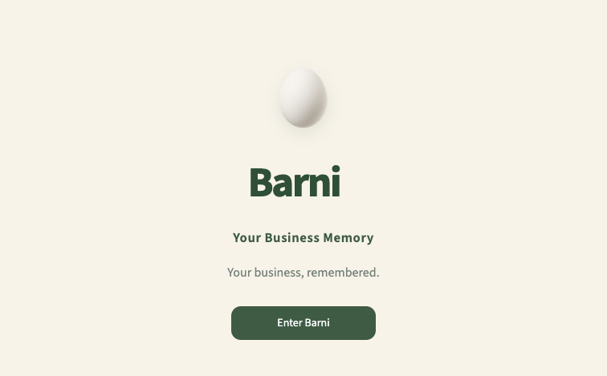
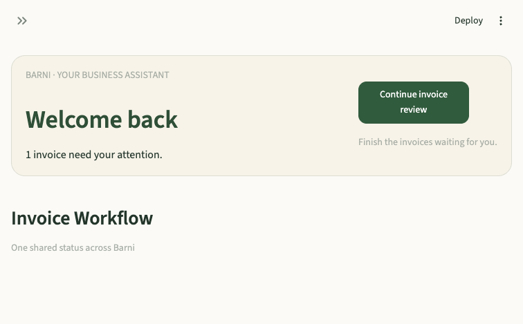
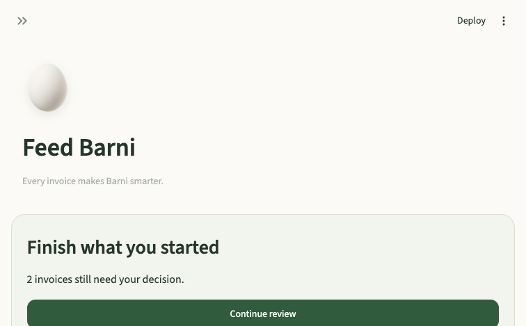
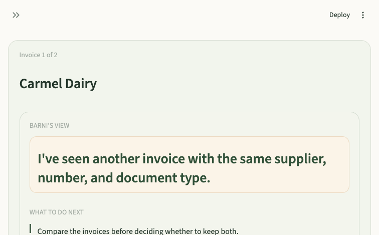
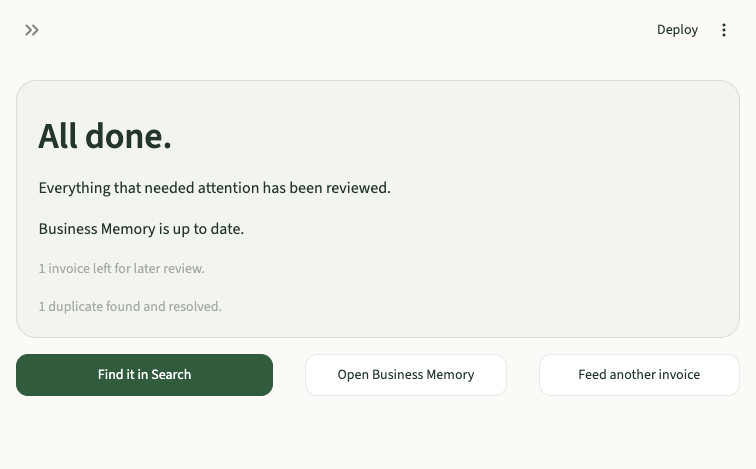
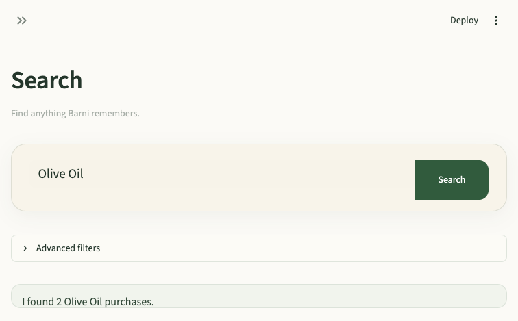
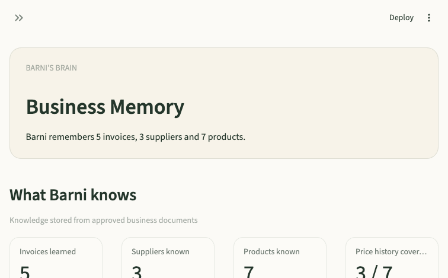
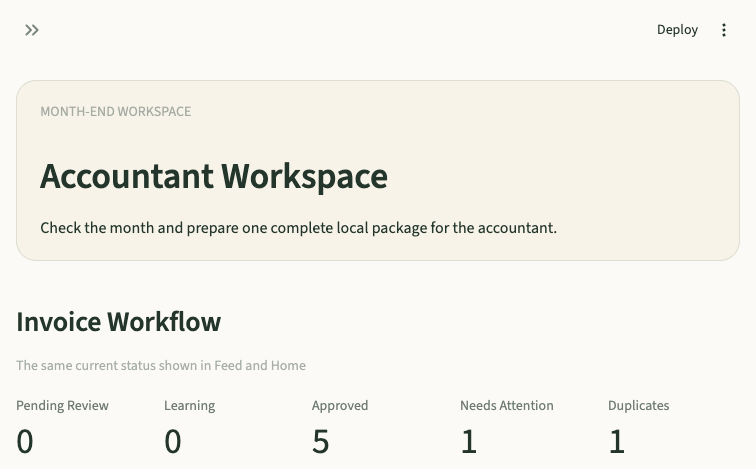

# BAROS Release Candidate Review Package

## Package Authority

This is the only input for BAROS review roles evaluating the current Barni Alpha release candidate. Review the artifact and behavior described here. Do not infer unlisted features, fixes, or evidence.

Package created: 9 August 2026  
Repository base: `ac5bbd63b6a77a5de1017dd1686b9dba254339f9` (`BAR-ALPHA-01: unify invoice lifecycle`)  
Artifact state: working-tree release candidate; not committed or tagged  
Application: Barni Alpha 0.3  
Demo business: Cedar Table Demo Restaurant

## Build Summary

This RC hardens Barni's first restaurant-owner journey:

> Feed Barni → Read invoice → Review → Approve → Business Memory → Search → Insights → Accountant export

The build uses one shared invoice lifecycle across customer pages. Approval propagates immediately to Search, Business Memory, evidence-backed stories, and Accountant Workspace. Failure states preserve the source and return the owner to a usable next step without exposing technical exceptions.

The current working tree contains application, service, UI, test, operational-documentation, and demo-environment changes beyond the base commit. It is not yet a clean, immutable release artifact. Review approval applies only to the exact working tree used for this package.

## Features Changed

### Trusted invoice workflow

- Canonical invoice status and shared counters across Home, Feed, Business Memory, and Accountant Workspace.
- Idempotent approval and retry behavior.
- Immediate propagation after approval to Search, Business Memory, Business Facts, stories, and accountant readiness.
- Duplicate decisions and interrupted review remain explicit owner decisions.

### Feed and Review

- Feed prioritizes unfinished work and evidence-backed business stories.
- Review starts with Barni's conclusion, recommended next step, reasoning, evidence, and then editable invoice data.
- Clear completion feedback states what Barni learned.
- Failed reading remains safely reviewable or skippable.

### Recovery

- Customer-facing generic exceptions were replaced with contextual recovery states.
- Upload, reading, approval, PDF, Search, Business Memory, Identity Review, and export failures preserve usability.
- Retry paths retain source files and avoid duplicate learning in covered cases.

### Search and Business Memory

- Search supports supplier, product, invoice number, and date discovery with concise summaries.
- Search results open their supporting invoice.
- Business Memory shows learned invoices, suppliers, products, repeat price coverage, recent learning, and evidence drill-down.

### Insights and evidence

- Visible price-change stories consume trusted comparable facts.
- Claims link to source invoice evidence.
- Unsupported conclusions remain silent.

### Accountant Workspace

- Uses the shared invoice lifecycle and month readiness contract.
- Reports duplicates, missing sources, missing suppliers, and undated open work.
- Builds a local ZIP containing source invoices, Summary CSV, Summary PDF, and Metadata JSON.

### Operations

- Startup extraction preflight reports credential presence without revealing the secret.
- Reproducible Cedar Table demo with reset and verification commands.
- BAROS roles, gates, pipeline, Definition of Done, and release decision authority are defined in the canonical Engineering Playbook.

## Happy Path Screenshots

The screenshots are desktop captures from the isolated Cedar Table demo on this RC.

### 1. Landing



Expected: one centered `Enter Barni` action.

### 2. Home



Expected: the owner immediately sees that one invoice needs attention and receives one continuation action.

### 3. Feed Barni



Expected: unfinished review is prioritized; upload remains available; recent stories are evidence-backed.

### 4. Invoice Review



Expected: conclusion and next action appear before editable invoice evidence; the duplicate is explained without technical terminology.

### 5. Review Completion



Expected: duplicate resolution is acknowledged, deferred work is explicit, and the owner receives clear next destinations.

### 6. Search



Expected: `Olive Oil` returns two purchases, source invoices, latest price, and supplier.

### 7. Business Memory



Expected: five approved invoices resolve to three suppliers and seven products with real price-history coverage.

### 8. Accountant Workspace



Expected: five approved source documents are available; unresolved duplicate and undated review work are reported rather than hidden.

## Test Summary

### Current automated run

Command:

```bash
.venv/bin/python -m unittest discover -s tests -p 'test_*.py' -q
```

Result:

- **99 tests passed.**
- **0 test failures.**
- Runtime: approximately 1.36 seconds on the package machine.
- The run emits repeated `ResourceWarning` messages for unclosed SQLite connections. These warnings do not currently fail the suite.

### Demo contract

Command:

```bash
.venv/bin/python demo_environment.py verify
```

Result: **PASS**

Verified:

- Five approved invoices.
- Three canonical suppliers.
- At least seven canonical products.
- One duplicate review case.
- One failed-reading recovery case.
- Product and supplier Search.
- Trusted Olive Oil price comparison of +14.3%.
- Accountant month and package generation.
- Evidence files for every approved invoice.

### Live five-invoice acceptance evidence

The real configured extraction path was exercised separately with five representative restaurant documents:

| Gate | Result |
|---|---|
| Source preservation | 5/5 |
| Review or safe recovery | 5/5 |
| Usable core extraction | 4/5 |
| Unhandled customer-facing exceptions | 0 |
| Immediate Business Memory update | 5/5 |
| Immediate Search discovery | 5/5 |
| Accountant source coverage | 5/5 across June and July packages |

Observed manual correction:

- The photographed invoice required supplier and product entry.
- One mixed Hebrew/English invoice required a product/service line.
- Two invoices surfaced questionable tax breakdowns for review.
- The multi-line statement correctly surfaced a missing invoice number.

## Known Limitations

### Release artifact

- The RC is an uncommitted working tree with modified and untracked files. It is not yet a reproducible commit or tag.
- Review decisions must identify this exact artifact; subsequent edits invalidate approval.

### Demo startup

- `demo_environment.py verify` succeeds without an extraction credential.
- The application-wide startup preflight still blocks the demo UI when `OPENAI_API_KEY` is absent, even though seeded demo review does not call extraction.
- The screenshot session used a non-secret placeholder presence value and did not upload or extract a document.
- Real upload review requires a valid credential configured before Streamlit starts.

### Acceptance gate

- Live extraction met the minimum 4/5 usable-core threshold, not 5/5.
- The credential-bearing acceptance process was not stop-and-relaunched after the live batch. Persistence was independently verified from the isolated database and archive, but the procedural restart gate remains open.

### Data and recovery

- If both the primary intake queue and its backup are corrupt, the queue currently fails closed as empty rather than returning a typed unavailable state.
- A permanently missing source PDF cannot be relinked to an existing approved invoice.
- Approval converges through idempotent retry but is not one atomic transaction across every learning subsystem.
- SQLite connection ownership produces warnings and may create long-session resource or locking pressure.

### Experience and operations

- Accountant export is synchronous and may make large months wait.
- Operational error logging is best-effort.
- The screenshots cover desktop only; narrow-layout visual review is not included in this package.
- The seeded demo intentionally begins with one duplicate and one failed-reading case. Accountant readiness remains conditional until the owner reviews them.
- The demo URL is local to the review machine and is not a hosted environment.

## Demo URL

When the package process is running:

> http://localhost:8510

This URL is available only on the local review machine. If it is not running:

```bash
.venv/bin/python demo_environment.py reset
OPENAI_API_KEY=<configured-value> .venv/bin/python demo_environment.py start --port 8510
```

Never place the credential value in a review report, screenshot, log, or source file.

## Exact Reviewer Workflow

All reviewers must use the following sequence. Do not review isolated screens out of order.

### Preparation

1. Confirm this package identifies the working-tree RC being reviewed.
2. Run the full test command and record the result.
3. Run `demo_environment.py verify` and require every demo check to pass.
4. Open `http://localhost:8510` at desktop width.
5. Confirm no customer-facing exception or technical credential value is visible.

### Customer journey

1. **Landing:** select `Enter Barni`.
2. **Home:** confirm the page explains that an invoice needs attention and offers one primary continuation.
3. **Feed Barni:** confirm unfinished review is prioritized and the upload action remains available.
4. **Duplicate Review:** open `Continue review`, compare the duplicate evidence, and select `Skip duplicate` for the seeded Carmel Dairy duplicate.
5. **Failed Reading:** confirm the source remains in review, the failure language is calm, and manual correction or `Skip for now` is available. Select `Skip for now`.
6. **Completion:** confirm Barni reports one deferred invoice and one resolved duplicate without claiming both were learned.
7. **Search by product:** search `Olive Oil`. Require two purchases, Fresh Fields Produce, latest price ₪48.00, and source invoice access.
8. **Search by supplier:** search `Fresh Fields Produce`. Require both matching approved invoices.
9. **Search by invoice:** search `FF-1002`. Require the correct source invoice to open.
10. **Business Memory:** require 5 invoices, 3 suppliers, 7 products, evidence-linked history, and 3/7 repeat-price coverage.
11. **Insights:** require the Olive Oil +14.3% story to show current ₪48.00, previous ₪42.00, and source evidence. Reject unsupported recommendations.
12. **Accountant Workspace:** require 5 approved documents and 0 missing source files. Confirm unresolved open work remains visible.
13. **Export:** prepare the package. Require the download action and verify the ZIP contains five source documents, Summary CSV, Summary PDF, and Metadata JSON.

### Review rules

- Do not change source data to make a gate pass.
- Do not accept screenshots as a substitute for running the workflow.
- Do not expose or inspect extraction secret values.
- Do not treat a known limitation as a new defect unless observed behavior is worse than documented.
- Record every rejection with the exact step, observed behavior, expected behavior, severity, and reproducible evidence.
- Any implementation change after review returns the artifact to the Builder and invalidates later-stage approvals affected by that change.

### Required reviewer output

Each role returns exactly one decision:

- `APPROVE`
- `REJECT`
- `BLOCKED — INSUFFICIENT EVIDENCE`

The decision must include:

1. Steps completed.
2. Evidence observed.
3. Release-blocking findings.
4. Non-blocking risks.
5. The exact artifact reviewed.

The Release Manager may authorize release only after every mandatory BAROS gate approves the same artifact.
